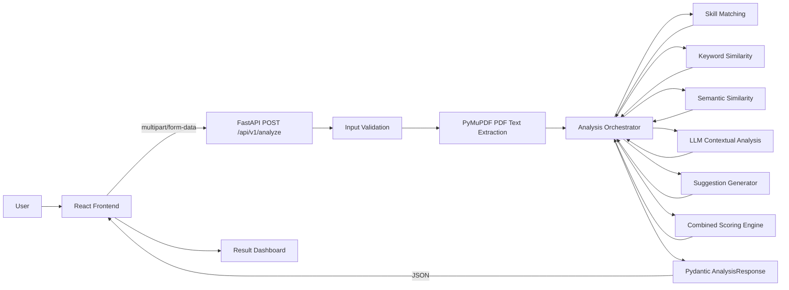

# ATS Resume Analyzer: Complete Project Flow

## 1. Project Overview

ATS Resume Analyzer is a full-stack application that compares a candidate's PDF resume with a job description.

The application produces:

- An ATS compatibility score from 0 to 100
- The existing objective score and component breakdown
- Optional LLM contextual analysis when `OPENAI_API_KEY` is configured
- Skills found in both the resume and job description
- Skills required by the job description but not found in the resume
- Technical skills detected in the resume
- Practical suggestions for improving the resume

The project has two applications:

- **Frontend:** React with Vite, Axios, and Tailwind CSS
- **Backend:** FastAPI with PyMuPDF, scikit-learn, sentence-transformers, and the OpenAI Responses API

The browser never performs the resume analysis itself. It collects the inputs, sends them to the backend, and renders the backend response.

---

## 2. High-Level Architecture



The request path is:

1. User selects a PDF resume.
2. User pastes a job description.
3. React validates that both values exist.
4. Axios sends both values to FastAPI as multipart form data.
5. FastAPI validates the file and text.
6. PyMuPDF extracts readable text from the PDF.
7. The analysis service runs skill, keyword, and semantic comparisons.
8. The backend optionally calls the LLM once for structured contextual analysis.
9. The backend combines objective and contextual scores in Python.
10. The backend creates suggestions with LLM suggestions when available and rule-based suggestions as fallback.
11. FastAPI validates the response against a Pydantic schema.
12. React displays the score and analysis sections.

---

## 3. Important Project Files

### Frontend

| File | Responsibility |
|---|---|
| `frontend/src/App.jsx` | Mounts the analyzer page |
| `frontend/src/pages/AnalyzerPage.jsx` | Owns page state and submit workflow |
| `frontend/src/components/FileUpload.jsx` | Selects and removes the PDF file |
| `frontend/src/components/JobDescriptionInput.jsx` | Captures the job description |
| `frontend/src/components/ResultCard.jsx` | Displays the analysis response |
| `frontend/src/components/ProgressBar.jsx` | Displays the numerical score visually |
| `frontend/src/components/SkillTags.jsx` | Displays skill lists |
| `frontend/src/services/api.js` | Sends the Axios API request |

### Backend

| File | Responsibility |
|---|---|
| `backend/app/main.py` | Creates FastAPI, configures CORS, and registers routes |
| `backend/app/routes/resume_routes.py` | Handles HTTP input validation and endpoint behavior |
| `backend/app/services/pdf_service.py` | Extracts text from PDF bytes |
| `backend/app/services/analysis_service.py` | Coordinates the complete analysis |
| `backend/app/services/scoring_service.py` | Calculates objective score components, LLM context score, and final score |
| `backend/app/services/llm_service.py` | Calls OpenAI once for structured contextual analysis and handles fallback errors |
| `backend/app/services/skill_service.py` | Detects known skills and compares skill sets |
| `backend/app/services/suggestion_service.py` | Generates rule-based recommendations |
| `backend/app/schemas/analysis_schema.py` | Defines the response contract |
| `backend/app/schemas/llm_schema.py` | Defines and validates the LLM structured output contract |
| `backend/app/utils/text_cleaner.py` | Normalizes text for matching |
| `backend/app/utils/config.py` | Loads environment configuration |

This separation follows a simple layered design: routes handle HTTP concerns, services handle business logic, and schemas define data contracts.

---

## 4. Frontend Flow: From User Input to API Request

### 4.1 Application startup

`frontend/src/App.jsx` renders `AnalyzerPage`.

`AnalyzerPage` initializes these React state values:

```text
resumeFile       = null
jobDescription   = ""
result           = null
error            = ""
isLoading        = false
```

These values control the complete browser workflow.

### 4.2 Selecting the resume

`FileUpload.jsx` renders a hidden file input with:

```text
accept="application/pdf"
```

When the user chooses a file:

1. The browser creates a `File` object.
2. `handleChange` reads the first selected file.
3. The file is passed to `AnalyzerPage` through `onFileChange`.
4. `resumeFile` stores the file object.
5. The selected filename appears in the interface.

The component also provides a remove button. Removing the file sends `null` back to the page.

The `accept` attribute improves the browser experience, but the backend remains the real security and correctness boundary because client-side restrictions can be bypassed.

### 4.3 Entering the job description

`JobDescriptionInput.jsx` is a controlled textarea.

Its value comes from `AnalyzerPage` and every change updates `jobDescription`. The user can paste the complete job description, including responsibilities, qualifications, and required technologies.

### 4.4 Client-side submit validation

When the user clicks **Analyze Resume**, `handleSubmit` runs:

1. Prevent the browser's default form submission.
2. Clear the previous error and result.
3. Reject the request if no PDF is selected.
4. Reject the request if the job description is empty after trimming whitespace.
5. Set `isLoading` to `true`.
6. Call `analyzeResume` from `api.js`.

The button is also disabled when there is no file, no non-whitespace job description, or an analysis is already running.

This validation improves user feedback, but the same validation is repeated on the backend because the backend must not trust browser state.

---

## 5. HTTP Request Details

`frontend/src/services/api.js` creates a `FormData` object:

```text
resume          -> selected PDF File object
job_description -> pasted job description string
```

Axios sends this object to:

```text
POST http://localhost:8000/api/v1/analyze
```

The base URL can be changed with `VITE_API_BASE_URL`.

The request uses `multipart/form-data` because it contains both a binary file and regular form text. The browser/Axios request reaches the FastAPI route registered under the `/api/v1` prefix.

The configured Axios timeout is 120 seconds. This allows time for PDF processing and the first sentence-transformer model load.

---

## 6. Backend Startup and Routing

`backend/app/main.py` creates the FastAPI application.

During startup it:

1. Creates the FastAPI app with a title, description, and version.
2. Configures CORS from `CORS_ORIGINS`.
3. Allows the frontend origin to call the backend from the browser.
4. Registers the resume router with the `/api/v1` prefix.
5. Exposes `/` and `/health` utility endpoints.

The final endpoint path is therefore:

```text
/api/v1/analyze
```

Without CORS configuration, a browser frontend running on port 5173 would be blocked from calling a backend running on port 8000, even though the backend itself was available.

---

## 7. Backend Request Validation

The endpoint in `resume_routes.py` receives:

```python
resume: UploadFile = File(...)
job_description: str = Form(...)
```

FastAPI parses the multipart request and provides the uploaded file and text value.

The route performs these checks in order:

### Check 1: File type

The route requires:

```text
resume.content_type == "application/pdf"
```

If not, it returns HTTP 400 with:

```text
Only PDF resume files are supported.
```

### Check 2: Job description

The route trims and checks the job description. An empty value returns HTTP 400:

```text
Job description cannot be empty.
```

### Check 3: File contents

The route reads the uploaded file into memory with `await resume.read()`.

An empty byte sequence returns HTTP 400:

```text
Uploaded resume file is empty.
```

### Check 4: Valid PDF structure

The raw bytes are passed to `extract_text_from_pdf`. Invalid or corrupted PDFs are converted into a controlled HTTP 400 error.

### Check 5: Readable text

If the PDF contains no extractable text, the endpoint returns HTTP 400:

```text
Could not extract readable text from this PDF.
```

This commonly happens with image-only scanned resumes because the current implementation does not include OCR.

---

## 8. PDF Text Extraction

`pdf_service.py` uses PyMuPDF, imported as `fitz`.

The process is:

1. Open the in-memory bytes with `fitz.open(stream=file_bytes, filetype="pdf")`.
2. Iterate through every page.
3. Call `page.get_text("text")` for each page.
4. Append every page's text to a list.
5. Join page text with newline characters.
6. Strip leading and trailing whitespace.
7. Close the PDF document in a `finally` block.

The backend does not save the resume permanently. It reads the upload into memory, extracts the text, analyzes it, and returns the result.

The extracted resume text and the original job description then become the two inputs to the analysis service.

---

## 9. Analysis Orchestration

`analysis_service.py` is the coordinator. It does not perform every algorithm itself. Instead, it calls specialized services:

```text
resume_text + job_description
        |
        +--> calculate_objective_score_breakdown
        +--> compare_skills
        +--> get_detected_resume_skills
        +--> analyze_resume_context
        +--> calculate_hybrid_ats_score
        +--> generate_suggestions
        |
        +--> AnalysisResponse
```

The sequence is:

1. Calculate the existing objective score and its skill, keyword, and semantic breakdown.
2. Calculate matched and missing skills.
3. Extract all known skills found in the resume.
4. Try one structured OpenAI Responses API call for contextual analysis.
5. If the LLM succeeds, calculate the contextual score and hybrid ATS score in Python.
6. If the LLM fails or is not configured, fall back to the existing objective score.
7. Merge LLM suggestions with deterministic rule-based suggestions.
8. Construct an `AnalysisResponse` object.
9. Return it to FastAPI.

The route and service layers remain separate, which makes it easier to test analysis logic without creating an HTTP request.

---

## 10. Text Normalization

`text_cleaner.py` provides `normalize_text` for matching operations.

It:

1. Converts all characters to lowercase.
2. Replaces characters outside letters, numbers, spaces, and selected symbols with spaces.
3. Collapses repeated whitespace.
4. Removes leading and trailing whitespace.

For example, text becomes easier to compare when `Python`, `PYTHON`, and `python` are treated consistently.

The allowed symbols include characters useful for technical terms, such as `.`, `+`, `#`, `/`, and `-`.

---

## 11. Skill Detection and Comparison

### 11.1 Skill dictionary

`skill_service.py` contains a fixed `TECHNICAL_SKILLS` set with technologies and professional terms such as:

```text
python, java, javascript, react, fastapi, sql, docker,
aws, kubernetes, machine learning, nlp, pandas, numpy,
scikit-learn, tensorflow, pytorch, rest api, testing, agile
```

This is dictionary-based skill extraction, not an external AI skill extraction model.

### 11.2 Extracting skills

`extract_skills(text)`:

1. Normalizes the input text.
2. Iterates through every known skill.
3. Builds a case-insensitive regular expression for each skill.
4. Searches for the skill in the normalized text.
5. Adds found skills to a set so duplicates are removed.
6. Returns a sorted list.

The regular expression includes boundaries to reduce false matches inside longer words. Spaces in multi-word skills are allowed to match flexible whitespace.

### 11.3 Comparing resume and job description

The service creates two sets:

```text
resume_skills = skills found in the resume
job_skills    = skills found in the job description
```

Then it calculates:

```text
matched_skills = resume_skills intersection job_skills
missing_skills = job_skills difference resume_skills
```

Both results are sorted lists.

Important interpretation:

- A matched skill is known to appear in both texts.
- A missing skill appears in the job description's supported dictionary but not in the resume.
- A skill outside the dictionary is invisible to this comparison.

---

## 12. ATS Score Calculation

The existing objective score combines three signals. This base engine is preserved and remains useful even when the LLM is unavailable.

### 12.1 Skill match score: 45 percent

```text
required skills = matched skills + missing skills
skill score = number of matched skills / number of required skills
```

If the job description contains no recognized skills, the skill score is `0.0` rather than dividing by zero.

### 12.2 Keyword similarity: 25 percent

The system normalizes both texts and uses scikit-learn's `CountVectorizer` with:

```text
stop_words = "english"
ngram_range = (1, 2)
```

This creates a bag-of-words representation containing single words and two-word phrases.

It then computes cosine similarity between the resume vector and job-description vector:

```text
cosine similarity = dot(A, B) / (magnitude(A) * magnitude(B))
```

If vectorization fails, for example because there are no usable terms, the keyword score becomes `0.0`.

This signal focuses on overlapping wording and phrases. It does not understand meaning by itself.

### 12.3 Semantic similarity: 30 percent

The system loads the configured sentence-transformer model, which defaults to:

```text
all-MiniLM-L6-v2
```

The model encodes the resume and job description into numerical embedding vectors. `util.cos_sim` compares the two vectors.

This signal can identify related meaning even when exact wording differs. For example, related descriptions of building web services may be closer semantically than a strict keyword comparison would suggest.

The result is clamped to the range `0.0` through `1.0`.

The model is cached with `@lru_cache(maxsize=1)`, so the model is loaded once per backend process and reused for later requests.

### 12.4 Weighted objective formula

The implementation calculates:

$$
\text{objective score} =
(0.45 \times \text{skill score}) +
(0.25 \times \text{keyword score}) +
(0.30 \times \text{semantic score})
$$

Then it clamps the result to `[0, 1]`, multiplies by 100, and rounds to an integer:

$$
\text{base score} = \operatorname{round}(100 \times \operatorname{clamp}(\text{objective score}, 0, 1))
$$

The base score therefore always falls between 0 and 100.

Example:

```text
skill score     = 0.80
keyword score   = 0.60
semantic score  = 0.90

objective score = (0.80 * 0.45) + (0.60 * 0.25) + (0.90 * 0.30)
                = 0.78

base score      = round(0.78 * 100)
                = 78
```

### 12.5 LLM contextual score

When the OpenAI call succeeds, the LLM returns three normalized dimensions. The LLM does not return the final ATS score.

```text
LLM contextual score =
  (contextual skill alignment * 0.50)
  + (experience relevance * 0.30)
  + (project relevance * 0.20)
```

These values are validated by Pydantic and clamped before scoring.

### 12.6 Final hybrid score

When LLM analysis is available:

```text
final score =
  (objective score * 0.70)
  + (LLM contextual score * 0.30)
```

The final result is clamped to `[0, 1]`, multiplied by 100, and rounded.

When LLM analysis is unavailable:

```text
final score = base score
```

---

## 13. Suggestion Generation

Suggestions are generated in two layers:

- `llm_service.py` can return personalized suggestions grounded in the resume and job description.
- `suggestion_service.py` always provides deterministic fallback suggestions.

When LLM analysis is available, the analysis service merges LLM suggestions first and rule-based suggestions second, removing duplicates. When LLM analysis is unavailable, the frontend still receives the rule-based suggestions.

Rules:

1. If missing skills exist, suggest making truthful existing evidence more explicit for the first six missing skills.
2. If the ATS score is below 70, suggest mirroring relevant job-description wording.
3. If the ATS score is below 70, suggest adding measurable impact such as percentages, revenue, time saved, or scale.
4. If fewer than five skills matched, suggest creating a dedicated categorized Skills section.
5. Always suggest ATS-friendly formatting: simple headings, no tables for core content, and a readable PDF.

The rule-based suggestions are deterministic. The same score and skill lists produce the same fallback suggestions.

---

## 14. Response Contract

The backend returns an `AnalysisResponse` Pydantic object with:

```json
{
  "ats_score": 84,
  "base_score": 78,
  "skill_score": 80,
  "keyword_score": 60,
  "semantic_score": 90,
  "matched_skills": ["fastapi", "python", "sql"],
  "missing_skills": ["aws", "docker"],
  "detected_resume_skills": ["fastapi", "python", "react", "sql"],
  "llm_analysis_available": true,
  "llm_error": null,
  "required_skills": ["python", "fastapi", "sql", "docker", "aws"],
  "preferred_skills": ["kubernetes"],
  "contextual_matched_skills": ["python", "fastapi", "backend api development"],
  "contextual_missing_skills": ["aws deployment evidence"],
  "skill_evidence": [
    {
      "skill": "fastapi",
      "evidence": "Resume mentions a FastAPI backend project.",
      "evidence_strength": "explicit"
    }
  ],
  "experience_relevance": 80,
  "project_relevance": 70,
  "contextual_skill_alignment": 85,
  "strengths": ["Backend API work aligns with the JD responsibilities."],
  "weaknesses": ["Cloud deployment evidence is limited."],
  "suggestions": [
    "Make existing backend project impact more measurable.",
    "Keep formatting ATS-friendly: use simple headings, avoid tables for core content, and export as a readable PDF."
  ],
  "llm_explanation": "The score combines strong backend alignment with weaker cloud evidence."
}
```

Pydantic enforces that score fields are integers between 0 and 100, LLM score dimensions are normalized before conversion, and all skill, evidence, and suggestion fields follow the declared schema.

This schema acts as a contract between the backend and frontend. If the backend response does not match the schema, FastAPI reports a response validation error instead of silently returning an inconsistent structure.

---

## 15. Returning and Rendering the Result

After Axios resolves:

1. `analyzeResume` returns `response.data`.
2. `AnalyzerPage` stores that object in `result`.
3. `isLoading` changes back to `false` in the `finally` block.
4. React re-renders `ResultCard` with the new data.

`ResultCard.jsx` renders:

- A result label
- `Strong Match` when the score is at least 75
- Otherwise `Needs Optimization`
- The numerical final ATS score
- The base objective score
- A progress bar
- Objective breakdown: skill, keyword, and semantic scores
- Contextual breakdown when LLM analysis is available
- Matched skills
- Missing skills
- Detected resume skills
- LLM required and preferred skills when available
- Contextual matches and gaps when available
- Strengths, weaknesses, and skill evidence when available
- Improvement suggestions
- A concise score explanation when available

Before a result exists, the card shows an empty-state message instead.

If the API fails, the page reads `apiError.response?.data?.detail` when available. That means backend validation messages such as `Could not extract readable text from this PDF.` can be shown to the user. If no backend detail is available, the frontend shows a generic error message.

---

## 16. Complete Sequence Example

Assume the user uploads `resume.pdf` and pastes a job description requiring Python, FastAPI, SQL, Docker, and AWS.

1. The file input produces a browser `File` object.
2. React stores the file and job description in state.
3. The user submits the form.
4. Axios creates multipart fields named `resume` and `job_description`.
5. FastAPI receives the request at `/api/v1/analyze`.
6. The route verifies the MIME type is PDF.
7. The route reads the bytes and PyMuPDF extracts text from all pages.
8. The skill service detects Python, FastAPI, and SQL in the resume.
9. The job description contains Python, FastAPI, SQL, Docker, and AWS.
10. Matched skills become Python, FastAPI, and SQL.
11. Missing skills become Docker and AWS.
12. The scoring service calculates the 45/25/30 objective score.
13. The LLM service tries one contextual analysis request if `OPENAI_API_KEY` is configured.
14. The scoring service calculates the hybrid score if LLM analysis is available, or keeps the base score if it is not.
15. Suggestions are merged from LLM and rule-based sources.
16. Pydantic validates the response object.
17. FastAPI serializes it to JSON.
18. Axios returns the JSON to React.
19. The result card shows the score, objective breakdown, contextual sections when available, skill tags, and suggestions.

---

## 17. Error Paths

| Situation | Where detected | Result |
|---|---|---|
| No file selected | Frontend | Local validation error; no request is sent |
| Empty job description | Frontend and backend | HTTP 400 from backend or local validation message |
| Non-PDF upload | Backend | HTTP 400: only PDF files are supported |
| Empty uploaded file | Backend | HTTP 400: uploaded file is empty |
| Corrupted PDF | PDF service and route | HTTP 400: invalid or corrupted PDF |
| Image-only/scanned PDF | Backend text check | HTTP 400: no readable text extracted |
| No usable keyword terms | Scoring service | Keyword similarity becomes 0.0 |
| No recognized job skills | Scoring service | Skill score becomes 0.0 |
| Missing OpenAI key or LLM failure | LLM service | Existing score is returned and `llm_analysis_available` is `false` |
| Malformed LLM response | Pydantic validation | Existing score is returned and no raw model error is exposed |
| API/network failure | Frontend catch block | Backend detail or generic error is displayed |
| First semantic request is slow | Model loading | Model download/load occurs before scoring; later requests reuse it |

---

## 18. How to Run the Project

### Backend

```powershell
cd resume-analyzer/backend
python -m venv .venv
.\.venv\Scripts\Activate.ps1
pip install -r requirements.txt
uvicorn app.main:app --reload
```

Backend URLs:

```text
http://localhost:8000
http://localhost:8000/health
http://localhost:8000/docs
```

### Frontend

Open a second terminal:

```powershell
cd resume-analyzer/frontend
npm install
npm run dev
```

Frontend URL:

```text
http://localhost:5173
```

The frontend normally uses:

```text
VITE_API_BASE_URL=http://localhost:8000/api/v1
```

The backend normally uses:

```text
CORS_ORIGINS=http://localhost:5173,http://127.0.0.1:5173
EMBEDDING_MODEL_NAME=all-MiniLM-L6-v2
OPENAI_API_KEY=
OPENAI_MODEL=gpt-4.1-mini
OPENAI_TIMEOUT_SECONDS=30
```

---

## 19. Testing Strategy

### Manual browser test

1. Start the backend.
2. Start the frontend.
3. Open the frontend URL.
4. Upload a text-based PDF resume.
5. Paste a job description containing known skills.
6. Click Analyze Resume.
7. Verify the final score, base score, objective breakdown, and skill sections appear.
8. With `OPENAI_API_KEY` configured, verify contextual breakdown, strengths, weaknesses, evidence, and explanation appear.
9. Without `OPENAI_API_KEY`, verify the score still appears and contextual analysis is marked unavailable.
10. Try an empty submission and verify the frontend validation.
11. Try a non-PDF file and verify the backend error.
12. Try a scanned PDF and verify the readable-text error.

### Direct API test

FastAPI automatically exposes Swagger UI at `/docs`.

Use `POST /api/v1/analyze`, upload a PDF, enter the job description, and execute the request. This separates backend behavior from frontend behavior during debugging.

### Useful unit-test targets

The smallest high-value tests would cover:

- `normalize_text`
- `extract_skills`
- `compare_skills`
- `calculate_keyword_similarity`
- `calculate_skill_match_score`
- `calculate_objective_score_breakdown`
- `calculate_llm_context_score`
- `calculate_hybrid_ats_score`
- `generate_suggestions`
- LLM fallback when `OPENAI_API_KEY` is missing
- LLM schema validation failure fallback
- PDF error handling
- The complete route response shape

The semantic model can be mocked in unit tests so tests do not download a model or depend on embedding output.

---

## 20. Strengths and Current Limitations

### Strengths

- Clear frontend/backend separation
- Small route layer with business logic moved into services
- Typed response contract using Pydantic
- Multiple scoring signals instead of exact keyword matching only
- LLM context improves synonyms, evidence, strengths, weaknesses, and personalized suggestions
- Final score remains controlled by backend Python code
- LLM failures fall back to the existing objective score
- Cached embedding model to avoid loading it for every request
- Useful validation and user-facing error messages
- No permanent resume storage in the current request flow

### Current limitations

- Skill extraction only recognizes skills in the hard-coded dictionary.
- The system does not perform OCR for scanned image PDFs.
- The upload is read fully into memory, so large-file limits should be added for production.
- The semantic model can make the first request slow and can require significant memory.
- There is no authentication, user history, database, or saved analysis record.
- LLM suggestions depend on OpenAI API availability and quality of extracted resume text.
- The LLM can improve context but is still constrained by the supplied resume/JD and validation schema.
- Skill presence does not prove skill proficiency or actual experience.
- The score is an application-specific indicator, not the score of a real employer's ATS.
- The default final weights are heuristic and should be calibrated with labeled outcomes for production.
- The current implementation checks the declared MIME type; production systems may also inspect file signatures and enforce size limits.

Possible future improvements include OCR, a configurable skill taxonomy, file-size limits, asynchronous/background processing, persistent analysis history, authentication, more robust PDF security checks, and calibrated scoring with labeled examples.

---

## 21. Interview Explanation: Short Version

> This is a React and FastAPI hybrid ATS resume analyzer. The user uploads a PDF and enters a job description in the React frontend. React sends both values as multipart form data to `POST /api/v1/analyze`. FastAPI validates the inputs, extracts text with PyMuPDF, then runs the existing objective engine: dictionary skill overlap weighted at 45%, count-vector keyword cosine similarity weighted at 25%, and sentence-transformer semantic similarity weighted at 30%. The backend optionally calls OpenAI once for structured contextual analysis, validates that response with Pydantic, and computes the final score in Python as 70% objective score plus 30% LLM contextual score. If OpenAI is unavailable, the app falls back to the existing objective score. React renders the final score, objective breakdown, contextual sections when available, skills, and recommendations.

Note: the implementation uses `CountVectorizer`, not TF-IDF weighting. In an interview, describe it accurately as count-vector or bag-of-words n-gram cosine similarity unless the implementation is changed.

---

## 22. Interview Questions and Answers

### Why use `multipart/form-data`?

Because the request contains a binary PDF file and a text field. Multipart encoding supports both in one HTTP request.

### Why validate on both frontend and backend?

Frontend validation gives fast user feedback. Backend validation protects the API because clients can bypass browser code.

### Why separate routes and services?

Routes should handle HTTP concerns. Services should handle reusable business logic. This improves maintainability and testability.

### How is the ATS score calculated?

The base score is a weighted combination of skill match, keyword cosine similarity, and semantic embedding similarity. The weights are 45%, 25%, and 30%. When LLM analysis is available, the final score is 70% base objective score and 30% contextual score. The LLM never directly returns the final score.

### What is the difference between keyword and semantic similarity?

Keyword similarity measures shared surface terms and phrases. Semantic similarity compares embedding vectors and can capture related meaning even when exact words differ.

### Why cache the embedding model?

Loading a transformer model is expensive. Caching it means one backend process can reuse the loaded model across requests.

### What happens if the PDF is scanned?

PyMuPDF may extract no text. The route returns an error because OCR is not currently implemented.

### Is this really an AI system?

It combines deterministic rules, machine learning, and an optional LLM layer. Skill extraction is dictionary-based, semantic similarity uses a pretrained sentence-transformer model, and the OpenAI layer adds structured contextual analysis when configured.

### What does CORS solve?

It allows the browser frontend's origin to call the backend origin. Without the configured frontend origin, the browser blocks cross-origin requests.

### What would you improve for production?

I would add authentication, file-size and file-signature validation, OCR, asynchronous processing for large documents, model/resource monitoring, persistent history, tests, rate limiting, and a more complete skill taxonomy.

### What is one important scoring caveat?

A detected keyword does not prove the candidate has meaningful experience with that skill. The score is a matching heuristic and should support, not replace, human review.
